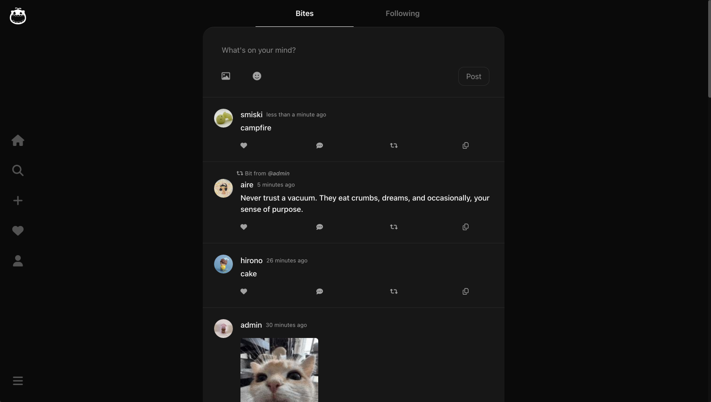
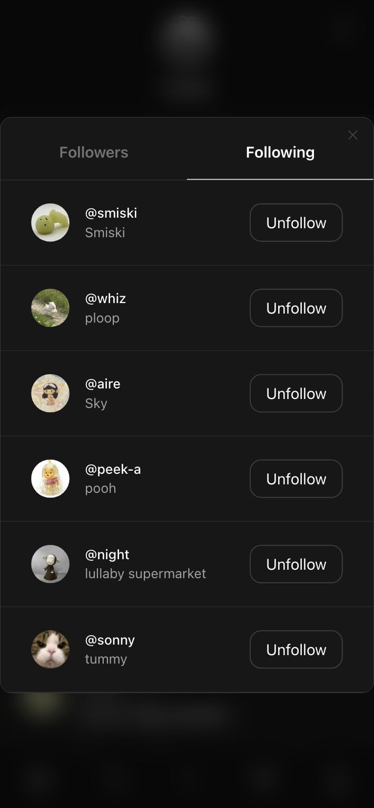

# MONCH - A Threads/X Clone (Full-Stack Social Media App)

A full-featured, comprehensive social media application built with **Django** (Python), **React.js**, and **PostgreSQL** — designed to emulate the core functionality of modern social media platforms with responsive UI and robust backend architecture.

**🔗 [Live Preview](https://monch-app.vercel.app/login)**  

  

## Tech Stack

**Frontend**
- React.js (with functional components and hooks)
- Tailwind CSS (styling)
- Axios (API requests)

**Backend**
- Python Django (REST API)
- JWT Authentication
- Factory Boy + Faker for testing

**Database & Hosting**
- PostgreSQL (hosted on [Neon](https://neon.tech))
- AWS S3 (media storage)
- Vercel (frontend deployment)

## Features

### User Profiles

- Users can **create and personalize profiles** with:
  - Profile picture
  - Custom bios  
  - Modifiable display name

  

    
### Bites, Replies, Reposts & Media

- Compose and share status, thoughts, ideas or information **"bites"**
- **Reply** to other posts, allowing nested post and replies
- **Upload images** in jpg, png, or gif format in posts and replies
- Support for **emojis** in all user-generated content
- **Repost** or "bite" other posts
- **Delete tweets, replies, and retweets**
- **Date and time formatting** (e.g. “5 minutes ago”)

### Social Interactions

- **Follow/Unfollow** other users
- View **followers and following lists**
- **Like and Repost** posts  
- Support for **undoing likes and retweets**
- **Real-time UI updates** on likes, retweets, follows, and more

### 🔍 Search & Explore

- Search for:
  - Specific keywords within posts  
  - User accounts  

### Authentication & Security

- Custom **JWT-based user authentication**
- Passwords hashed with **Django authentication library**
- **Access control** implemented on secure routes and user data
- Built with React hooks and protected endpoints

### Performance & UX

- **Real-time updates** using React Query
- **Infinite scroll** UX pattern on frontend with **pagination** (Django REST framework) for seamless feed browsing
- **Responsive UI** for adapting to mobile, tablet, and desktop screen sizes
- Built with **React + Vite** for modern routing, fast built time, and optimized frontend performance

## More Feature Previews:
### Posts with nested replies

  

### Mobile Search Page, Create Post Modal, Follow List

  &nbsp;&nbsp;&nbsp;
  &nbsp;&nbsp;&nbsp;
  

